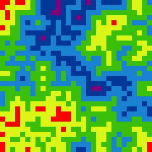
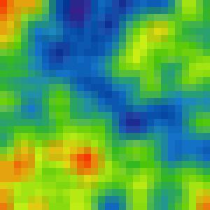
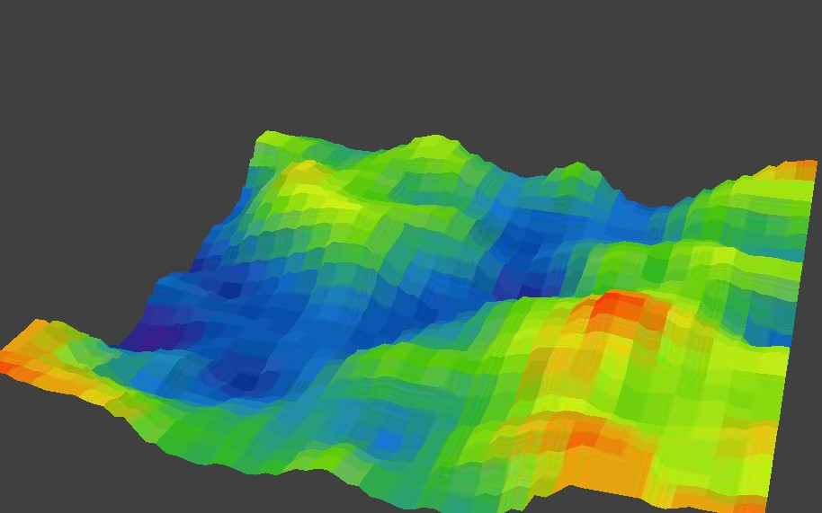
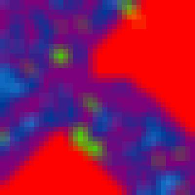
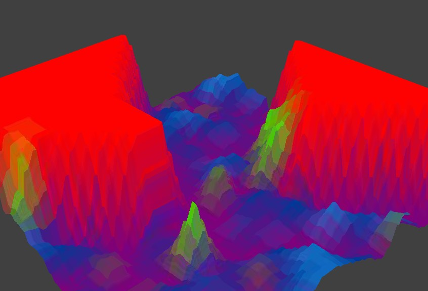

# WFC-Terrain-Generator-v2

Procedural Terrain Generator using the Wave Function Collapse algorithm ([WFC implementation](https://github.com/JuanSoriaE/WFC)).

## Topographic Terrain

The Wave Function Collapse algorithm allows us to generate procedural images based on initial rules that tell us which states can be adjacent of which other states.
In the other hand we know that in the Color Topographic Map the points with the highest height, has as adjacent points the second highest height, and the second highest height points, has as adjacent points the 3th highest height points. Knowing that, the pattern is clear:

| ID | Highest |
| -- | ------- |
| 0 | 1st |
| 1 | 2nd |
| 2 | 3rd |
| 3 | 4th |
| 4 | 5th |
| 5 | 6th |

Considering the table above, the rules of the states and its adyacents will be the next.


We can see that the middle states are connected with 2 adjacent states, and itself. And the edge states are connected just with one adjacent state and itself, so the Adjacent Dictionary will be the next:

```
adj_dic = {0: [0, 1], 1: [0, 1, 2],
           2: [1, 2, 3], 3: [2, 3, 4],
           4: [3, 4, 5], 5: [4, 5]}
```

With the dictionary and the following parameters we will get the next image:

### INPUT

```
ini_state = [0, 1, 2, 3, 4, 5]
n = 50
m = 50
neighbors_based = False

# Colors
color_map: dict = {0: '#fd0200', 1: '#daf516',
                   2: '#3ac00a', 3: '#1a82d3',
                   4: '#013897', 5: '#7c027c'}
```

### OUTPUT
If we convert the grid into a image, we will get a grid-patterned image, since the the number of states is too low. One way to fix this is to get the average color of every cell with its 8 adjacent cells.

| Direct Output | Averaging colors | 3D View |
| ------------- | ---------------- | ------- |
|  |  |  |

This image was with basic parameters, so here are some more examples.

#### EXAMPLES

| Smooth Image | 3D View | Parameters |
| ------------ | ------- | ---------- |
|  |  | `ini_state = [0, 1, 2, 3, 4, 5]`<br>`n = 40, m = 40`<br>`adj_dic = {0: [0], 1: [0, 1, 2], 2: [1, 2, 3, 5], 3: [2, 3, 4, 5], 4: [3, 4, 5], 5: [4, 5]}`<br>`neighbors_based = True`<br> |
