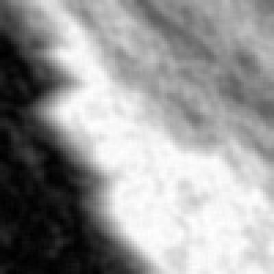
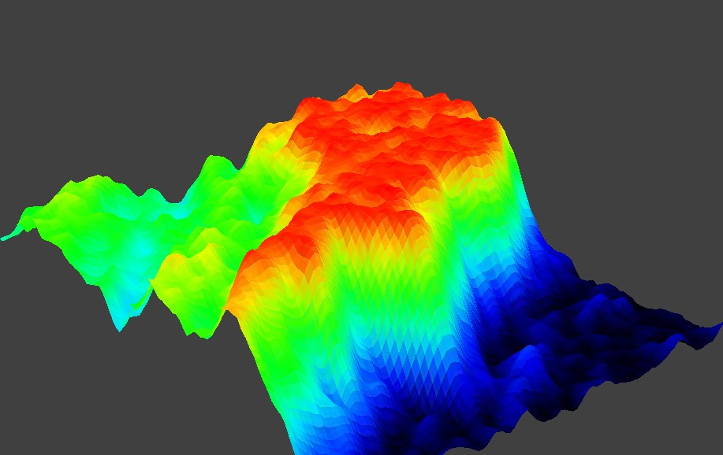
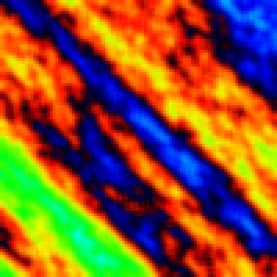
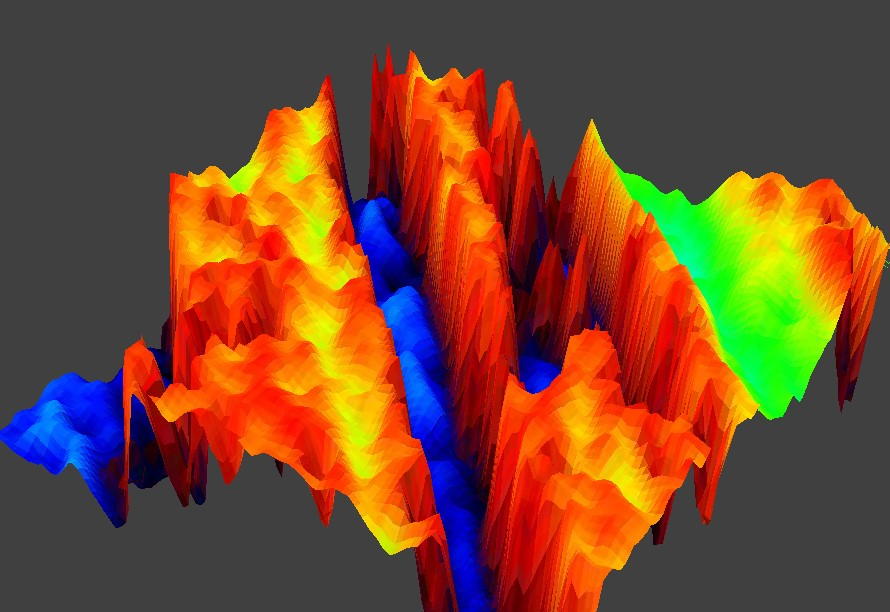
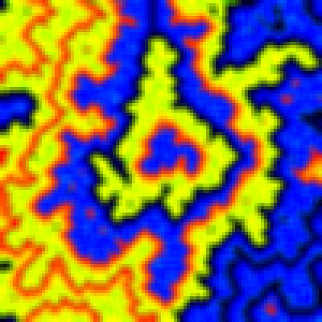

# WFC-Terrain-Generator-v2

Procedural Terrain Generator using the Wave Function Collapse Algorithm ([WFC implementation](https://github.com/JuanSoriaE/WFC)).

## Topographic Terrain (Introduction)

The Wave Function Collapse Algorithm generate images based on given rules that determinate which states can be adjacent to which others states.

The basic Color Topographic Map determines which heights are adjacent to which others, which serve as initial rules.

The pattern is the following:
The 1st-highest is adjacent with the 2nd-highest, and the 2nd-highest is adjacent with the 1st-highest and the 3rd-highest, and so on.

Translating this into an Adjacency Dictionary is:

```
adj_dic: dict = {0: [0, 1], 1: [0, 1, 2],
                 2: [1, 2, 3], 3: [2, 3, 4],
                 4: [3, 4, 5], 5: [4, 5, 6],
                 6: [5, 6, 7], 7: [6, 7, 8],
                 8: [7, 8, 9], 9: [8, 9, 10],
                 10: [9, 10, 11], 11: [10, 11, 12],
                 12: [11, 12, 13], 13: [12, 13, 14],
                 14: [13, 14, 15], 15: [14, 15]}
```

With the `adj_dict` above and the following parameters we will get the next result:

### INPUT
```
ini_state: list = [0, 1, 2, 3, 4, 5, 6, 7, 8, 9, 10, 11, 12, 13, 14, 15]
n = 100
m = 100
ini_cell = (0, 0)
adj_offs = [(0, -1), (1, 0), (0, 1), (-1, 0)]
neighbors_based = False

# Colors
COLORS: dict = {0: '#ff0000', 1: '#ff5000',
               2: '#ffa000', 3: '#ffff00',
               4: '#a0ff00', 5: '#50ff00',
               6: '#00ff00', 7: '#00ff50',
               8: '#00ffa0', 9: '#00ffff',
               10: '#00a2ff', 11: '#0050ff',
               12: '#0000ff', 13: '#0000a0',
               14: '#000050', 15: '#000000'}
```

### OUTPUT
The limited number of states produces a grid-patterned output image. To enhance it, we can average the color of each cell with its 8-adjacent cells to get the height-map.

| Direct Output | Heightmap averaging colors | 3D View |
| ------------- | ---------------- | ------- |
|  |  |  |

## Get Started

Make sure to have Python 3.6+ and pip installed.

### STEPS
1. Clone this repository.
    ```
    git clone https://github.com/JuanSoriaE/WFC-Terrain-Generator-v2.git
    ```
2. Once you are in the root path of the project, clone the repository of the WaveFunctionCollapsed module ([Link WFC module](https://github.com/JuanSoriaE/WFC)).
3. Install the dependencies.
    ```
    pip install Pillow ursina numpy
    ```
4. Run the main.py file.
    ```
    python main.py
    ```
5. You can modify all the parameters from the `main.py` file.

## Examples with Custom Parameters

All the images below uses the same `COLORS`.
| Averaging colors Image | 3D View (Generated with GREY-SCALE Topographic Map image) | Non-default Parameters |
| ------------ | ------- | ---------- |
|  |  | `adj_dic: = {0: [15, 0, 1], 1: [0, 1, 2], 2: [1, 2, 3], 3: [2, 3, 4], 4: [3, 4, 5], 5: [4, 5, 6], 6: [5, 6, 7], 7: [6, 7, 8], 8: [7, 8, 9], 9: [8, 9, 10], 10: [9, 10, 11], 11: [10, 11, 12], 12: [11, 12, 13], 13: [12, 13, 14], 14: [13, 14, 15], 15: [14, 15, 0]}` |
|  |  | `adj_dic: dict = {0: [0, 1], 1: [1, 2], 2: [2, 3], 3: [3, 4], 4: [4, 5], 5: [5, 6], 6: [6, 7], 7: [7, 8], 8: [8, 9], 9: [9, 10], 10: [10, 11], 11: [11, 12], 12: [12, 13], 13: [13, 14], 14: [14, 15], 15: [15]}`<br>`ini_cell: tuple = (49, 49)` |
|  |  | `adj_dic: = {0: [1], 1: [1, 2], 2: [2, 3], 3: [3, 4], 4: [0, 3, 4, 5, 15], 5: [0, 4, 5, 6, 15], 6: [0, 5, 6, 7, 15], 7: [0, 6, 7, 8, 15], 8: [0, 7, 8, 9, 15], 9: [0, 8, 9, 10, 15], 10: [0, 9, 10, 11, 15], 11: [0, 10, 11, 12, 15], 12: [11, 12], 13: [12, 13], 14: [13, 14], 15: [14]}`<br>`ini_cell: tuple = (49, 49)`<br>`neighbors_based: bool = True` |
|  |  | `adj_dic: = {0: [0, 1], 1: [1, 2], 2: [2, 3], 3: [3, 4], 4: [0, 3, 4, 5, 15], 5: [0, 4, 5, 6, 15], 6: [0, 5, 6, 7, 15], 7: [0, 6, 7, 8, 15], 8: [0, 7, 8, 9, 15], 9: [0, 8, 9, 10, 15], 10: [0, 9, 10, 11, 15], 11: [0, 10, 11, 12, 15], 12: [11, 12], 13: [12, 13], 14: [13, 14], 15: [14, 15]}`<br>`ini_cell: tuple = (49, 49)` |
